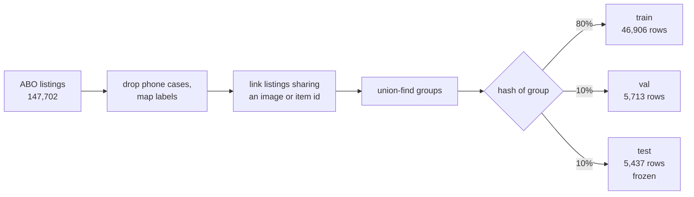
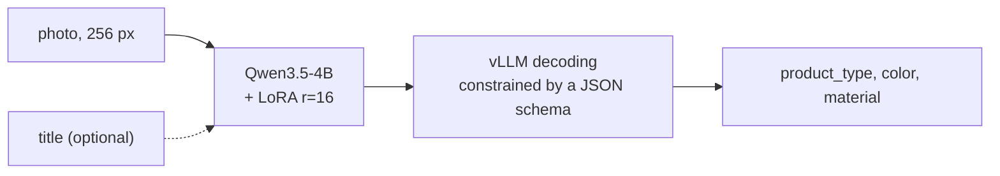
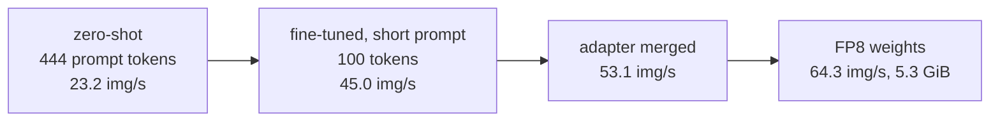

# Product attributes from photos with a small VLM

I fine-tuned Qwen3.5-4B to look at a product photo, optionally read its title, and return the product type, color and material as JSON. The data is Amazon Berkeley Objects (ABO), and everything runs on a single RTX 4090.

The short version:

- **Photo only.** LoRA fine-tuning takes the model from 0.703 / 0.716 / 0.797 (product type / color / material, zero-shot) to 0.862 / 0.786 / 0.880. A CLIP linear probe is a tough baseline here. The fine-tuned model beats it on color (+3.0 points) and ties on the other two.
- **Photo plus title.** Seller titles often spell out the answer, so a plain TF-IDF model on the title already gets 0.912 / 0.901 / 0.937. The fine-tuned VLM with the title reaches 0.921 / 0.930 / 0.920. That is the best color score of any method (+2.9 over title-only). A TF-IDF + CLIP logistic regression is still better on material.
- **Serving.** After fine-tuning, the label lists can come out of the prompt, the adapter can be merged into the weights, and the weights can go to FP8. Together that is 2.8x the zero-shot throughput at the same image size (23.2 to 64.3 images/s).

## Data and split

ABO has 147,702 listings. I dropped phone cases (44% of all listings, enough to swamp every metric) and kept the 37 product types with at least 300 training listings. Color comes from ABO's standardized color field, mapped to 16 classes. Material is free text, mapped to 9 classes; values that don't describe the pictured object, like "stone" on sofas, are left unlabeled.

Product variants reuse photos a lot: the same shoe in several sizes shows up as several listings sharing one picture. Splitting by item id would put the same image in train and test. So listings that share an image or an item id are grouped first, and whole groups are assigned to a split.



A check confirms that no item id, and no image apart from 73 generic ones (size charts, banners), appears in two splits. The test file's SHA-256 is pinned in `src/vpa/splits.py` and checked every time it is loaded, so labels can't change quietly after the fact. Test has 1,610 rows with a color label and 888 with a material label; each attribute is scored only on rows that have it.

## Model



- LoRA r=16 on the language model's attention, linear-attention and MLP projections. The vision encoder stays frozen.
- One epoch over 36,416 deduplicated (image, labels) pairs.
- Loss only on the answer. Many rows lack a color or material label, so those values are masked out instead of throwing the row away.
- At inference, a JSON schema whose enums are the label sets constrains decoding, so the output always parses and always uses valid labels.

A QLoRA run with the same settings (4-bit NF4 base) cut peak training memory from 9.82 to 6.98 GiB. It trained about 27% slower (12.54 against 17.09 examples/s) and lost 0.2 to 1.1 points of accuracy.

## Results

<!-- results:start -->
### Test

Frozen test split. Accuracy with macro-F1 in brackets, counted per row. Denominators: product_type 5,437 rows, color 1,610, material 888. VLM rows use 256 px images and JSON-schema constrained decoding.

| Method | Input | product_type | color | material |
|---|---|---|---|---|
| Majority class | - | 0.257 (0.011) | 0.249 (0.025) | 0.343 (0.057) |
| CLIP ViT-L/14 zero-shot | image | 0.638 (0.559) | 0.651 (0.532) | 0.584 (0.442) |
| CLIP ViT-L/14 linear probe | image | 0.854 (0.810) | 0.755 (0.704) | 0.884 (0.767) |
| Qwen3.5-4B zero-shot | image | 0.703 (0.621) | 0.716 (0.627) | 0.797 (0.617) |
| Qwen3.5-4B + QLoRA | image | 0.856 (0.818) | 0.784 (0.719) | 0.868 (0.805) |
| Qwen3.5-4B + LoRA | image | 0.862 (0.829) | 0.786 (0.722) | 0.880 (0.816) |
| Title TF-IDF + logistic regression | title | 0.912 (0.895) | 0.901 (0.876) | 0.937 (0.878) |
| Title TF-IDF + CLIP embedding, logistic regression | image + title | 0.928 (0.908) | 0.912 (0.868) | 0.938 (0.859) |
| Qwen3.5-4B zero-shot | image + title | 0.738 (0.665) | 0.791 (0.723) | 0.833 (0.694) |
| Qwen3.5-4B + LoRA | image + title | 0.921 (0.903) | 0.930 (0.903) | 0.920 (0.864) |

### Inference trade-offs (val, 5,713 rows, one RTX 4090, vLLM 0.30.0)

Accuracy per row on val. Weights memory is vLLM's reported model load size. Throughput is images per second over the whole split, with up to 128 concurrent requests, submitted in chunks of 512.

| Setting | Prompt tokens | Weights memory | Images/s | product_type | color | material |
|---|---|---|---|---|---|---|
| zero-shot, label lists in prompt, 768 px | 807 | 8.61 GiB | 13.3 | 0.683 | 0.719 | 0.804 |
| zero-shot, label lists in prompt, 256 px | 444 | 8.61 GiB | 23.2 | 0.678 | 0.716 | 0.773 |
| LoRA adapter served by vLLM, short prompt, 256 px | 100 | 8.70 GiB | 45.0 | 0.871 | 0.799 | 0.877 |
| LoRA merged into bf16 weights, short prompt, 256 px | 100 | 8.61 GiB | 53.1 | 0.870 | 0.799 | 0.876 |
| merged, FP8 weight quantization, short prompt, 256 px | 100 | 5.30 GiB | 64.3 | 0.872 | 0.792 | 0.877 |

Single-request latency, merged bf16, short prompt, 256 px, one request at a time (max_num_seqs=1): 372 ms per image on average over the first 300 val images, including image preprocessing.
<!-- results:end -->

Differences quoted above use paired McNemar tests on the test rows (`scripts/compare_predictions.py`). The color gain over the CLIP probe has p = 0.0005. With titles, the color gain over late fusion has p = 0.005, and the material gap to late fusion (-1.8 points) has p = 0.036. Rows that share a main image aren't independent, so these p-values lean optimistic.

Where it still goes wrong is in `docs/error_analysis.md`. The short list: boots against shoes, fine against regular jewelry (the labels are inconsistent there too), and upholstered chairs labeled with the frame's material. 262 test rows sit on 83 images that carry more than one product type, so no model can get all of them.

## Serving



Measured on val with vLLM 0.30.0. FP8 costs 0.65 points of color accuracy (p = 0.019) and nothing measurable elsewhere. One request at a time takes about 372 ms, image preprocessing included.

There is a small demo: a FastAPI service that loads both adapters, and a Streamlit page in front of it.

```
BASE_MODEL=<Qwen3.5-4B dir> LORA_IMAGE=outputs/train/lora_r16_short/final \
LORA_TITLE=outputs/train/lora_r16_short_title/final uvicorn demo.api:app --port 8000
streamlit run demo/app.py -- --api http://localhost:8000
```

`POST /extract` takes an image and an optional `title`.

## Running it

I ran training and vLLM in WSL2 (Ubuntu 24.04) with vLLM 0.30.0, torch 2.13, transformers 5.17, peft 0.21 and flash-linear-attention 0.5.2.

```
python scripts/download_abo_metadata.py
python scripts/build_dataset.py
python scripts/download_images.py small
python scripts/download_images.py original --splits val,test
python scripts/baseline_majority.py
python scripts/baseline_text.py
python scripts/baseline_clip.py
python scripts/baseline_fusion.py
python scripts/eval_vlm.py --model <Qwen3.5-4B dir> --name qwen3.5-4b_zeroshot_img256 --split test \
    --images data/images/img256 --chat-kwargs '{"enable_thinking": false}'
python scripts/train_lora.py --model <Qwen3.5-4B dir> --images data/images/img256 \
    --out outputs/train/lora_r16_short --prompt short --lr 2e-4
python scripts/train_lora.py --model <Qwen3.5-4B dir> --images data/images/img256 \
    --out outputs/train/lora_r16_short_title --prompt short --lr 2e-4 --with-title
python scripts/eval_vlm.py --model <Qwen3.5-4B dir> --lora outputs/train/lora_r16_short/final --prompt short \
    --name lora_r16_short_test --split test --images data/images/img256 --chat-kwargs '{"enable_thinking": false}'
python scripts/make_results_tables.py --bench-logs <benchmark log dir>
```

`docs/model_selection.md` covers how the model was picked. It has a small zero-shot comparison of Qwen3.5-4B, Gemma-4-E4B and Qwen3-VL-8B, and none of them stood out on accuracy.

## Data credit

Amazon Berkeley Objects, CC BY 4.0 (per the LICENSE file shipped with the data). Credit: Amazon.com. Collins et al., "ABO: Dataset and Benchmarks for Real-World 3D Object Understanding", CVPR 2022.
